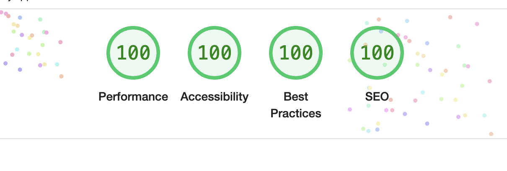

# All Challenges are from

[frontendmentor.io](https://www.frontendmentor.io/)

# Server

for my projects I use either [parceljs](https://www.frontendmentor.io/) or [vite](https://vitejs.dev/)

# How to start local server

Make sure you have [nodejs](https://nodejs.org/en) installed. If you never worked with nodejs before then go watch some youtube tutorials.

1. download the depedencies with:

```
  npm -i
```

2. start server (the code depends on the tool I use, just check the 'scripts' in package.json of each project):

```
  npm run start or npm run dev
```

&nbsp;&nbsp; something like this should appear in the terminal, click on the http\* link:

```
Server running at http://localhost:1234
✨ Built in 4ms
```

(optional) compile scss & optimize the files for deployment or whatever reason, this code will minify the css and js files, set a hash on the files etc.

```
  npm run build
```

# Live sites URL.

The projects are hosted online for free on [netlify](https://www.netlify.com/). It will last approximately for 3 months

- recipe-page-main: [https://recipe-page-tn.netlify.app/](https://recipe-page-tn.netlify.app/)

#### Since I don't have the Figma Design files for many projects, the results aren't pixel-perfect.

# Goals

- Write clean and well-structured SCSS without many repetitions for better maintainability
- Use BEM methodology
- Use images with the correct dimensions & type to ensure optimal performance and avoid unnecessary scaling.
- Implement best practices for achieving a strong website performance, including techniques like image optimization, code minification, font preload, SVG Sprites etc.
  

- Evaluate and identify the best tools, plugins, and workflow setup to maximize efficiency and productivity.
  Tools, plugins & methodology I am currently using/testing:

1. [Parceljs](https://parceljs.org/)
2. [vite](https://vitejs.dev/)
3. [webpack](https://webpack.js.org/)
4. [postcss](https://postcss.org/)
5. [postcss-sort-media-queries](https://www.npmjs.com/package/postcss-sort-media-queries)
6. [BEM methodology](https://getbem.com/)

# Youtubers recommandations to expand your knowledge & to keep you up-to-date on the latest features:

1. CSS / SCSS - [Kevin Powell](https://www.youtube.com/@KevinPowell)
2. CSS & Js - [Kyle](https://www.youtube.com/c/webdevsimplified)
3. Animations, CSS, JS - [Jhey](https://www.youtube.com/c/JheyTompkins)
4. Animations, CSS, JS - [Hyperplex](https://www.youtube.com/c/Hyperplexed)
